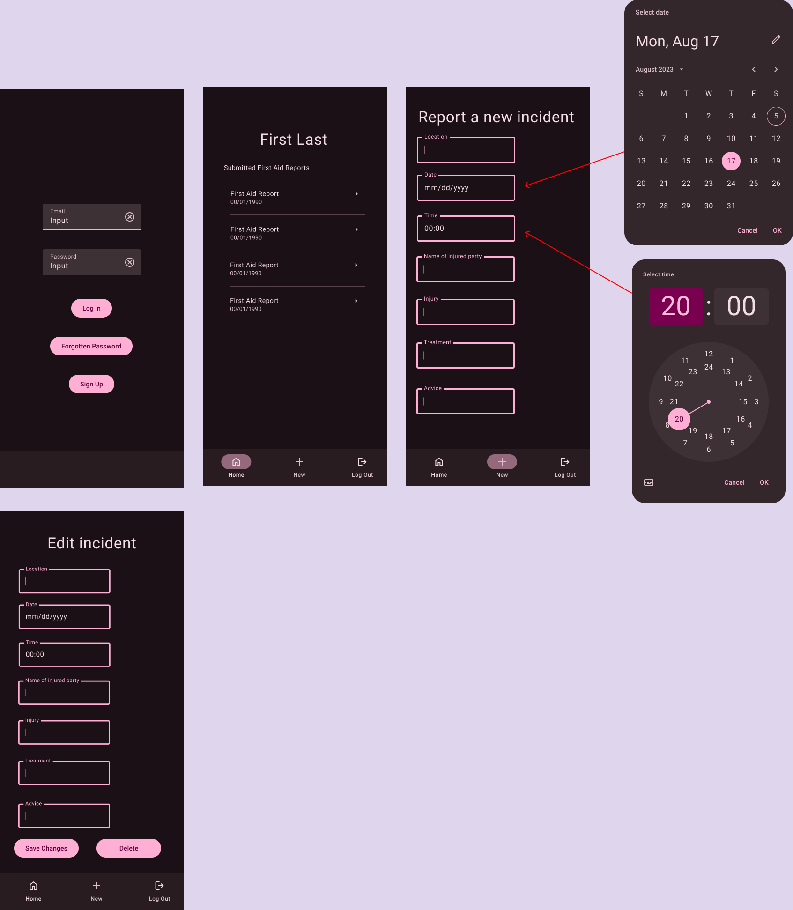

[README

Design idea: 

colours/styling not definitive

create = create a new first aid report
delete = delete a created first aid report
read = view first aid reports
update = edit submitted first aid report 

Show existing reports as a list on home page which when clicked on go through to formm with edit/delete option