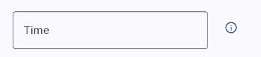

README

To Run the Project:
Create a realtime database on google Firebase. Download the google-services.json file and replace
the existing file within the app folder.

Within the AppContainer file (app/src/main/java/com/example/androidad/core/AppContainer.kt) change
the DATABASE_URL to the URL of your database realtime database.

The application utalises firebase authentication via email and password to sign in which needs to be
enabled within your firebase project authentication settings.

To run the automated UI tests you need to ensure you have created a user with the admin slider
selected within the app when emulated and a non admin user. Once these have been created their
details can be used to run the tests. Use the UserValuesExample template file within
app/src/androidTest/java/com/example/androidad/screens/UserValuesExample.kt. Renaming the file as
UserValues.kt will gitIgnore the file to keep your personal details private. Once the file has been
renamed add the values used to create your admin and non admin users to the file as entered to the
database and take not of the username provided within the database and enter the values to
UserValues as required. The tests will automatically read the values from user values within
ScreenTests to initialize the test values.

Figma Design:

colours/styling not definitive

Decision to keep time as free text as people dont usually know the exact time of a incident

Testing all passed!

Will require commit combing before making public due to personal details within test 